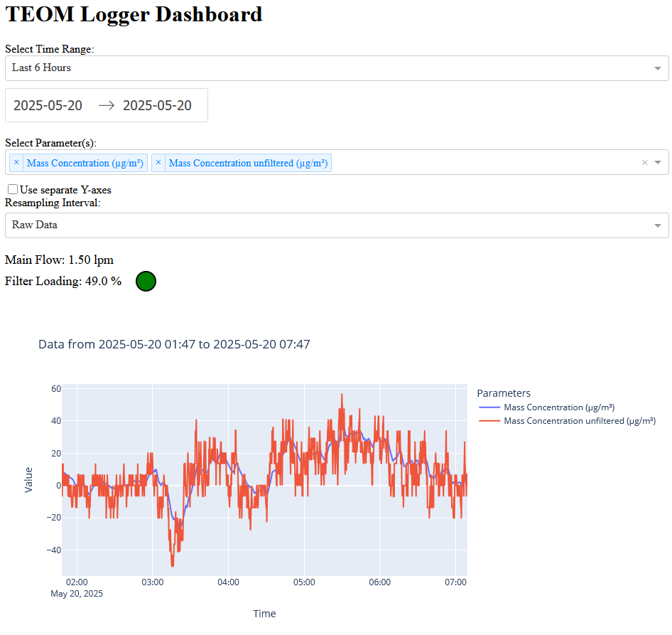

# teom_areg_logger

A simple Python-based logger and dashboard for the **TEOM 1400AB** air quality monitor.  
This tool logs data from the TEOM via serial port and stores daily CSV files.  
A browser-based dashboard provides real-time and historical data visualization.

## 📚 Table of Contents

- [🚀 Usage](#-usage)
- [⚙️ Configuration](#️-configuration)
- [📋 Logged Parameters](#-logged-parameters)
- [📊 Dashboard Overview](#-dashboard-overview)
- [🧪 About the Unfiltered Mass Concentration](#-about-the-unfiltered-mass-concentration)
- [🐛 Troubleshooting](#-troubleshooting)
- [📄 License](#-license)

---

## 🚀 Usage

1. **Clone or copy** the repository to your desired directory.
   ```bash
   git clone https://github.com/alejandrokeller/teom_areg_logger
   ```
3. **Install dependencies** using:
   ```bash
   pip install -r requirements.txt
   ```
4. **Create the `config.ini`** file:
   ```bash
   cp config.template config.ini
   ```
5. **Edit `config.ini`** according to the configuration section below
6. **Start the logger**:
   ```bash
   python teom_areg_logger.py
   ```
7. **In a second terminal**, start the dashboard server:
   ```bash
   python teom_dashboard.py
   ```
8. **Open your browser** and go to: [http://127.0.0.1:8050](http://127.0.0.1:8050)

---

## ⚙️ Configuration

All configuration is now managed via the `config.ini` file.  
This file centralizes logger and dashboard settings for easier modification without editing the Python scripts.

### Sections
- `[LOGGER]`: Controls serial port connection and log storage.
- `[DASHBOARD]`: Controls data smoothing and default display settings.
- `[LAMP_THRESHOLDS]`: Defines filter loading alert behavior (green/yellow/red).

### `teom_areg_logger.py`

| Variable              | Description                                                    | Default      |
|-----------------------|----------------------------------------------------------------|--------------|
| `SERIAL_PORT`         | Serial port connected to the TEOM                              | `COM30`      |
| `BAUD_RATE`           | Serial port baud rate for communication with the TEOM          | `9600`       |
| `QUERY_INTERVAL_SECONDS` | Data logging interval (in seconds)                          | `10`         |
| `LOG_DIR`             | Folder where daily CSV logs are saved                          | `logs`       |
| `TIME_FORMAT`         | Timestamp format for the CSV log file                          | `%Y-%m-%d %H:%M:%S`     |

### `teom_dashboard.py`

| Variable               | Description                                                    | Default      |
|------------------------|----------------------------------------------------------------|--------------|
| `UNFILTERED_STEPS`     | Number of samples (back in time) to compute unfiltered mass    | `30`         |
| `LOG_DIR`              | Directory where CSV logs are located                           | `logs`       |
| `UNFILTERED_STEPS`     | Number of samples (back in time) to compute unfiltered mass    | `30`         |
| `DEFAULT_RESAMPLE`     | Smoothing interval. Use `'False'` for raw data (see list)      | `False`      |
| `DEFAULT_TIME_RANGE`   | Default display interval at dashboard start (see list)         | `last_hour`  |
| `YELLOW_THRESHOLD`     | Threshold for filter load warning (see dashboard section)      | `60`         |
| `RED_THRESHOLD_FLOW_3` | Threshold for filter load warning (see dashboard section)      | `90`         |
| `RED_THRESHOLD_FLOW_LOW` | Threshold for filter load warning (see dashboard section)    | `80`         |

Posible values for `DEFAULT_RESAMPLE`: `False`, `1min`, `10min`, `1H`

Posible values for `DEFAULT_TIME_RANGE`: `last_hour`, `last_6_hours`, `last_12_hours`, `today`, `this_month`, `custom`

### Example `config.ini`

```ini
[LOGGER]
serial_port = COM30
baud_rate = 9600
query_interval_seconds = 10
log_dir = logs
time_format = %Y-%m-%d %H:%M:%S

[DASHBOARD]
log_dir = logs
unfiltered_steps = 30
default_resample = False
default_time_range = last_hour

[LAMP_THRESHOLDS]
yellow_threshold = 60
red_threshold_flow_3 = 90
red_threshold_flow_low = 80
```

---

## 📋 Logged Parameters

The logger script `teom_areg_logger.py` records the following parameters from the TEOM 1400AB every 10 seconds (default):

| Parameter                             | Unit     |
|---------------------------------------|----------|
| Mass Concentration                    | µg/m³    |
| Mass Rate                             | µg/h     |
| Total Mass                            | µg       |
| Frequency                             | hz       |
| Noise                                 | µg       |
| Filter Loading                        | %        |
| Main Flow                             | lpm      |
| Aux Flow                              | lpm      |
| Status                                | code     |
| K0 Constant                           | g/s²     |
| Mass Concentration (30min Avg)        | µg/m³    |
| Mass Concentration (1hr Avg)          | µg/m³    |
| Serial Number                         | N/A      |
| Ambient Temperature                   | °C       |
| Ambient Pressure                      | atm      |

These are retrieved via AREG queries and saved to a daily CSV file.

Refer to the [TEOM 1400AB manual](manual-1400ab/EPM-manual-TEOM1400ab.pdf) (Appendices B and C) for parameter definitions and their correponding registry value.

## 📊 Dashboard Overview

The dashboard provides an interactive, browser-based interface to visualize and monitor TEOM 1400AB data. Key features include:

- **Time range selector** with presets (e.g., Last Hour, Today, This Month)
- **Multi-parameter graph** with optional separate Y-axes
- **Data resampling** to display raw data or averaged over 1min/10min/hour
- **Live values** for:
  - `Main Flow (lpm)`
  - `Filter Loading (%)`
- **Filter condition indicator lamp**:
  - 🟢 **Green**: Filter Loading < 60%
  - 🟡 **Yellow**: Filter Loading ≥ 60%
  - 🔴 **Red**: 
    - Filter Loading ≥ 90%
    - Filter Loading ≥ 80% and Main Flow < 3 lpm
  - When red, a warning message appears: `Replace filter soon!`

### Example Dashboard:


---

## 🧪 About the Unfiltered Mass Concentration

The TEOM reports:
- 30-minute average mass concentration
- 1-hour average mass concentration
- A smoothed 5-minute running average

However, the smoothed 5-minute value, wich undergoes internal smoothing beyond a simple average.
The resulting value may exclude, e.g., short-term fluctuations.  
For a better view of the data, the dashboard calculates a parallel **unfiltered running average** based solently on the accumulated mass in the filter during a fix number of sampling steps.
This calculation is derived from section 1.5.2 of the [TEOM manual](manual-1400ab/EPM-manual-TEOM1400ab.pdf):

### **Unfiltered Mass Concentration, `M`**
Calculated from the frequency change over time:

```
M = K0 × (1/f1² − 1/f0²) / (flow × Δt)
```

$$M = \frac{K_0 (f_1^{-2} − f_0^{-2})}{Q\delta t}$$

Where:
- `f0` is the former transducer frequency (`UNFILTERED_STEPS` back in time; configurable)
- `f1` is the new transducer frequency
- `K0` is the TEOM calibration constant
- `flow` is the TEOM main flow rate
- `Δt` is the elapsed time between the samples corresponding to `f0` and `f1`

You can adjust the `UNFILTERED_STEPS` to match the averaging period you want (e.g. 30 steps at 10s/step => 5 min).

---

## 🐛 Troubleshooting

If you encounter this error:
```
AttributeError: module 'typing_extensions' has no attribute 'Generic'
```
Fix it by upgrading the package:
```bash
pip install --upgrade typing_extensions
```

---

## 📄 License

This project is licensed under the GNU General Public License v3.0.  
See [LICENSE](LICENSE) for full terms.
